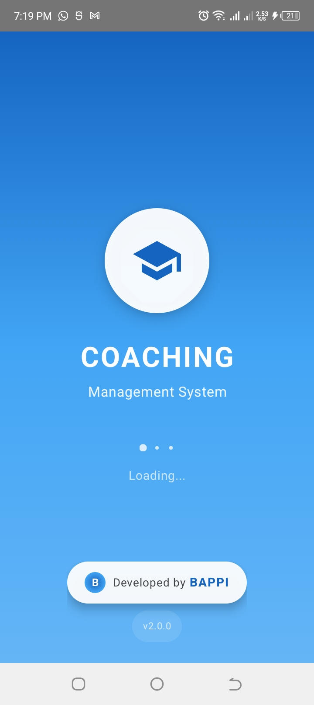
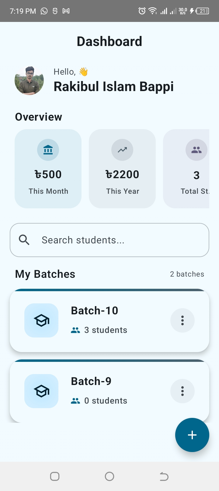
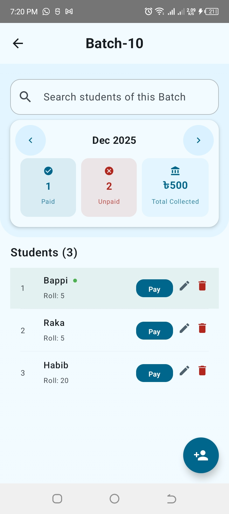

# 📚 Coaching Manager
### A Digital Financial Assistant for Teachers & Coaching Centers

**Coaching Manager** is a native Android application designed to digitize the administrative and financial workflows of educational coaching centers. Built to solve the chaos of manual paper registers, it allows teachers to track student fees, manage batches, and view real-time financial insights.

---

## 💡 The Problem & The Solution

**The Challenge:**
Many teachers in my local community manage huge numbers of students using pen and paper. This leads to:
* Difficulty tracking who hasn't paid fees for the current month.
* Calculation errors when totaling monthly earnings.
* Disputes with students regarding past payments.

**The Solution:**
I built **Coaching Manager** to act as a personal accountant for teachers. It replaces physical registers with a cloud-synced database, providing instant clarity on **Paid vs. Unpaid** students and generating transparent transaction histories.

---

## 📱 App Screenshots

|              Splash Screen               |              Dashboard               |       Batch Details (Paid/Unpaid)       |
|:----------------------------------------:|:------------------------------------:|:---------------------------------------:|
|  |  |  |

---

## 🚀 Key Features

### 📊 Financial Dashboard (Fintech Core)
* **Real-Time Analytics:** Instantly calculates "Monthly Collection" and "Yearly Collection" from thousands of transaction records.
* **Payment Stats:** Visual counters for "Paid" vs "Unpaid" students for the current month.

### 👥 Student & Batch Management
* **Digital Batches:** Organize students into specific batches (e.g., "Class 10 - Morning").
* **Smart Profile:** Stores detailed info including School, Roll, Class, and Section.
* **Global Search:** Find any student instantly across all batches using a unified search bar.

### 💰 Transaction Tracking
* **Immutable History:** Every payment is logged with a timestamp and amount.
* **Payment Filter:** Teachers can select a specific month (e.g., "October") and instantly see a list of students who haven't paid yet.
* **Cloud Sync:** Data is stored in Firestore, ensuring records are never lost even if the phone is broken.

### 📢 Monetization
* **AdMob Integration:** Integrated Banner and Interstitial ads strategically placed to generate revenue without disrupting the user workflow.

---

## 🛠 Tech Stack

* **Language:** Kotlin (100%)
* **UI Framework:** Jetpack Compose (Material 3 Design System)
* **Architecture:** MVVM (Model-View-ViewModel)
* **Backend:** Firebase Firestore (NoSQL Database)
* **Authentication:** Firebase Auth (Google Sign-In)
* **Async Processing:** Kotlin Coroutines & Flow
* **Dependency Injection:** ViewModel Factory pattern
* **Image Loading:** Coil

---

## 🧠 Technical Highlights

* **Complex Filtering Logic:** Implemented advanced filtering in `BatchDetailsViewModel` to cross-reference student payment arrays against selected calendar dates, allowing precise "Paid/Unpaid" status determination.
* **Atomic Updates:** Used `FieldValue.arrayUnion` in Firestore to safely append payment records without overwriting existing data, ensuring data integrity during concurrent writes.
* **Custom UI Components:** Built a custom `YLogoLoadingIndicator` using Canvas drawing API for a unique brand identity.
* **Offline-First UX:** Designed the UI to handle loading states gracefully using `SaveUiState` sealed classes.

---

## 👨‍💻 About the Developer

**Bappi**
*Software Engineer | Android Specialist | Problem Solver*

I enjoy building software that solves tangible problems for real people. Whether it's a food delivery ecosystem for a university or a management tool for village teachers, I focus on creating scalable, user-friendly solutions.

* **LinkedIn:** [linkedin.com/in/bappi-swe](https://www.linkedin.com/in/bappi-swe)
* **GitHub:** [github.com/BAPPI-SWE](https://github.com/BAPPI-SWE)

---

## 📥 Installation

1.  Clone the repository.
2.  Add your own `google-services.json` file to the `app/` directory.
3.  Build and run on Android Studio.